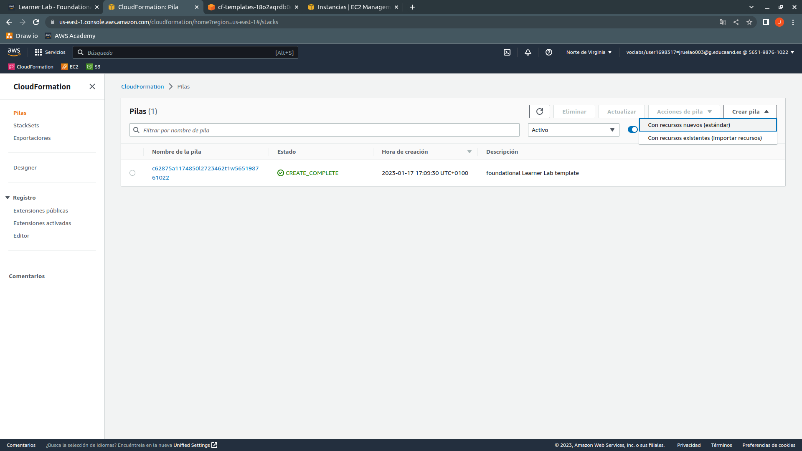
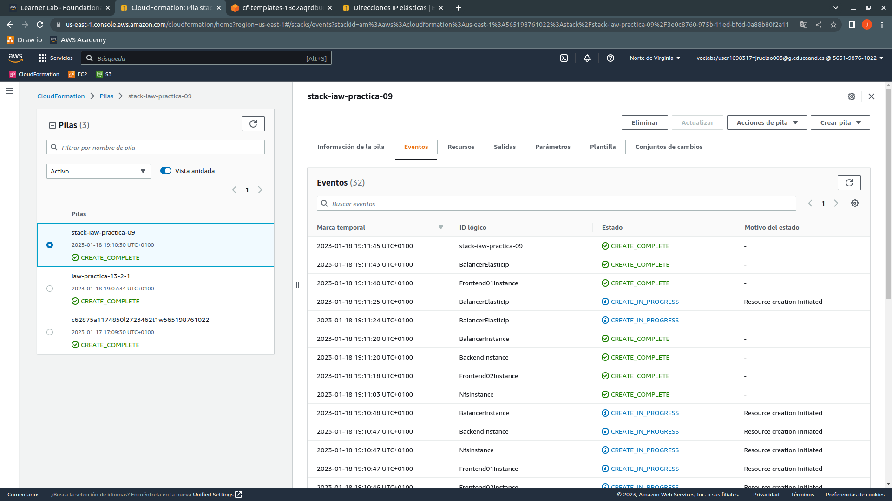

# iaw-practica-13.2

En esta práctica usaremos **CloudFormation de AWS para la creación de stacks** o pilas. Los stacks son el conjunto de grupos de seguridad, instancias, direcciones IP elásticas entre otras cosas.

**Usaremos plantillas para la creación de stacks**, estas plantillas estarán en formato YAML, por lo que habrá que tener cuidado con el formateo de los archivos que nos permitirán crear los stacks. Las plantillas nos servirán para crear los grupos de seguridad, las instancias, realizar la asociación de los grupos de seguridad a las instancias, la creación de direcciones IP elásticas y su asociación con las instancias.

**Enfocaremos la práctica a la creación de la infraestructura de la práctica 07 y de la práctica 09 en plantillas separadas**.

Cuando se haya finalizado la creación y agregación de contenido a las plantillas, **realizaremos la ejecución en CloudFormation de AWS Academy de una plantilla y de la otra plantilla mediante terminal usando AWS CLI**.

En un directorio crearemos la siguiente estructura de directorios y archivos para esta práctica:
    
+ **arquitectura-ejercicios**
    + iaw-practica-07.yaml

    + iaw-practica-09.yaml

+ **scripts-lanzado-stack**
    + stack-practica-07.sh

    + stack-practica-09.sh

    + variables.sh

## iaw-practica-07.yaml

**Vamos a seguir un orden que debemos respetar ya que de no seguirlo nos dará problemas la creación del stack**. Primero estableceremos las variables que usaremos en la plantilla, después crearemos los grupos de seguridad junto con sus reglas de entrada, después crearemos las instancias y por último realizaremos la creación de una dirección IP elástica y su asociación a la instancia que hará de balanceador de carga.

### Cabecera de plantilla y variables

Al principio de nuestra primera plantilla estableceremos la versión de plantillas de AWS y la descripción que tendrá el stack para realizar la diferenciación de otros stacks, además de realizar una explicación de la función del stack.

```yaml
AWSTemplateFormatVersion: '2010-09-09'
Description: |
  Esta plantilla sirve para crear la infraestructura para el despliegue de una pagina dinamica con formulario.
  Primero se establecerán los grupos de seguridad para la instancia frontend y la instancia backend.
  Despues estableceremos una direccion IP elastica para la instancia frontend y procederemos a crear las dos instancias.
```

Como he explicado al principio de este apartado, estableceremos las variables que usaremos, es posible que a priori no sepamos la cantidad de variables que vamos a necesitar ni su contenido, por lo que hay que ir realizando las modificaciones oportunas en la plantilla sobre la marcha.

**En el primer nivel usaremos Parameters para establecer que los subniveles que vienen a continuación forman parte de las variables** que inicializaremos y estableceremos su contenido. **En el segundo nivel están las variables que tendrán el nombre que queramos**, IdAmi, Ram4Gb, Ram8Gb..., cuanto más se asemejen a su función, mejor, y **dentro de cada variable tenemos tanto Type que nos permite especificar el tipo de variable** (String o cadena, Integer o numérica...) **como Default que será el contenido de la variable**. En este caso estoy definiendo la AMI que se usará para las instancias, la memoria RAM que tendrán, los nombres de las instancias, etc.

```yaml
Parameters:
  IdAmi:
    Type: String
    Default: ami-06878d265978313ca

  Ram4Gb:
    Type: String
    Default: t2.medium

  Ram8Gb:
    Type: String
    Default: t2.large
```

### Creación de grupos de seguridad

Al finalizar la preparación de las variables, procederemos primero a establecer **los recursos, Resources, de los que dispondremos** y la creación de los grupos de seguridad que necesitamos. **En el primer nivel tenemos Resources que nos permite establecer los recursos que vamos a crear**. **En el segundo nivel tenemos los recursos que vamos a crear** y tal y como hicimos con las variables, tendrán el nombre que queramos. **Primero establecemos el nombre de este recurso** que será un grupo de seguridad para el frontend o el backend, **así como el tipo de recurso (Type) que es**, **la creación de un grupo de seguridad**, AWS::EC2::SecurityGroup, **y sus propiedades, Properties**. Dentro de las propiedades tenemos GroupName que establece el nombre del grupo de seguridad, en este caso como estamos usando variables, **tenemos que usar Ref: junto al nombre de la variable para especificar el contenido que tendrá**. También asignaremos una descripción para el grupo de seguridad, GroupDescription, y las reglas de entrada que tendrá el grupo de seguridad, tenemos que establecer el protocolo que se usará, TCP (preferiblemente, ya que crea conexiones y evita todos los fallos posibles que se pueden dar) o UDP (no crea conexiones y si no llegan los paquetes, no se reenvían), el puerto de origen, FromPort, el puerto de destino, ToPort; en estos casos es el mismo puerto y desde que dirección IP acepta conexiones. Crearemos el otro grupo de seguridad y haremos referencia a las variables que corresponden con el grupo de seguridad que nos falta.

En el caso del grupo de seguridad de la instancia que hará de frontend, necesitará tener tres puertos de entrada establecidos, SSH para acceder a la instancia, HTTPS para las peticiones web cifradas y HTTP para las peticiones web en texto plano.

```yaml
Resources:
  FrontendNoBalancerSecurityGroup:
    Type: AWS::EC2::SecurityGroup
    Properties:
      GroupName:
        Ref: FrontendSecurityGroupName
      GroupDescription:
        Ref: FrontendSecurityGroupDescription
      SecurityGroupIngress:
        - IpProtocol:
            Ref: SgIpProtocol
          FromPort:
            Ref: SshPort
          ToPort:
            Ref: SshPort
          CidrIp:
            Ref: SgCidrIp

        - IpProtocol:
            Ref: SgIpProtocol
          FromPort:
            Ref: HttpsPort
          ToPort:
            Ref: HttpsPort
          CidrIp:
            Ref: SgCidrIp

        - IpProtocol:
            Ref: SgIpProtocol
          FromPort:
            Ref: HttpPort
          ToPort:
            Ref: HttpPort
          CidrIp:
            Ref: SgCidrIp
```

### Creación de instancias

Cuando hayamos terminado de establecer los grupos de seguridad, **procederemos con la creación de las instancias que formarán parte de Resources**. Como hicimos anteriormente, los segundos niveles tendrán el nombre que queramos y **estableceremos el Type** de recurso que tenemos, en este caso instancia, AWS::EC2::Instance. Con Properties estableceremos las características que tendrán las instancias. **Necesitamos el ID de la AMI que vamos a usar**, **ImageId**, en este caso Ubuntu Server 22.04, **la cantidad de memoria RAM** que vamos a asignar, **InstanceType**, **el grupo de seguridad que usará**, **que en este caso debemos hacer referencia al nivel del grupo de seguridad que hemos establecido para el frontend mediante !Ref seguido del segundo nivel del grupo de seguridad**, **el archivo de claves** que se usará para la conexión mediante SSH **y el nombre de la instancia**. De igual forma, realizaremos la creación de la otra instancia, salvo por las variables.

```yaml
  FrontendInstance:
    Type: AWS::EC2::Instance
    Properties:
      ImageId:
        Ref: IdAmi
      InstanceType:
        Ref: Ram4Gb
      SecurityGroups:
        - !Ref FrontendNoBalancerSecurityGroup
      KeyName:
        Ref: KeyFileName
      Tags:
        - Key: Name
          Value:
            Ref: FrontendInstanceName

```

### Creación de dirección IP elástica

Por último, crearemos la dirección IP elástica, una dirección aleatoria que se encuentre libre en ese momento, y su asignación a la instancia que hará de frontend.

El nombre del segundo nivel lo estableceremos según su función, en Type asignaremos el tipo de recurso, creación de dirección IP elástica y asociación a instancia y las propiedades que será el ID de la instancia a la que asignaremos la IP elástica. **Hay que tener en cuenta que debemos poner !Ref en la misma línea que InstanceId para que no falle en la asignación de la dirección IP a la cuenta y la asociación de la IP elástica a la instancia**.

```yaml
  FrontendElascticIp:
    Type: AWS::EC2::EIP
    Properties:
      InstanceId: !Ref FrontendInstance
```

### Uso de plantilla mediante CloudFormation en AWS con el navegador web

Accederemos mediante navegador a AWS Academy, iniciaremos el laboratorio y accederemos a AWS. Después, **usaremos el cuadro de búsqueda para acceder a CloudFormation**.


Dentro de CloudFormation, **pulsaremos en el botón Crear pila** y **posteriormente en Con recursos nuevos (estándar)**, ya que la opción Con recursos existentes (importar recursos) es una opción para usar recursos ya creados.



En la siguiente parte, **como tenemos una plantilla para nuestro stack**, **dejaremos La plantilla está lista marcada** y **marcaremos Cargar un archivo de plantilla si es la primera vez que la usamos y pulsamos en el botón Elegir archivo**. En el caso de que ya la hubiésemos usado, dejaríamos marcada la opción URL de Amazon S3 que es un contenedor de archivos, una nube. 


Accederemos al directorio que contiene nuestra plantilla y la seleccionamos para usar.


Cuando nuestra plantilla esté seleccionada, pulsaremos en el botón Siguiente para continuar.


Pondremos un nombre al stack y de paso podemos comprobar las variables que hemos establecido en la plantilla para comprobar que son correctas. **Pulsaremos en el botón naranja que hay en la parte inferior derecha hasta finalizar con la creación del stack**.


**Cuando hayamos pulsado el botón naranja que ponía Enviar**, habremos finalizado con la creación del stack y veremos el proceso de creación de los recursos que tenemos en la plantilla. No debería tardar mucho, por lo que **si no hemos tenido ningún fallo en la plantilla**, **en Eventos debería salir el nombre que hemos puesto al stack junto al estado CREATE_COMPLETE**.


Si queremos, podemos comprobar que los recursos se han creado correctamente, accederemos a EC2 e iremos primero a Grupos de Seguridad, deberían de haber dos grupos de seguridad con los nombres que hemos asignado a los grupos.


Después seguiremos con la comprobación de las instancias, deberán tener el nombre que hemos asignado a cada una, junto con el tipo de instancia (memoria RAM asignada).


Por último, comprobaremos que se ha asignado una dirección IP elástica a nuestra cuenta y que se ha asociado con la instancia que hace de frontend.


## iaw-practica-09.yaml

**En esta plantilla no hay nada nuevo con respecto a la plantilla anterior**, solo que es más larga por la arquitectura que hay que montar debido a que son cinco instancias, por lo que únicamente pondré la creación de la instancia que hará de balanceador de carga y la asignación de la IP elástica libre a la cuenta y su asociación a la instancia que será el balanceador de carga.

```yaml
  BalancerInstance:
    Type: AWS::EC2::Instance
    Properties:
      ImageId:
        Ref: IdAmi
      InstanceType:
        Ref: Ram4Gb
      SecurityGroups:
        - !Ref BalancerSecurityGroup
      KeyName:
        Ref: KeyFileName
      Tags:
        - Key: Name
          Value:
            Ref: BalancerInstanceName

  BalancerElasticIp:
    Type: AWS::EC2::EIP
    Properties:
      InstanceId: !Ref BalancerInstance
```

### Uso de plantilla mediante AWS CLI en el terminal

Para este caso podemos usar directamente los comandos en la terminal o un script para crear el stack mediante AWS CLI.

Para usar el comando directamente en la terminal, usamos:

```
aws cloudformation create-stack \
    --stack-name stack-iaw-practica-09 \
    --template-body file://../arquitectura-ejercicios/iaw-practica-09.yaml
```

Con el argumento --stack-name asignamos el nombre que tendrá el stack en CloudFormation, con el argumento --template-body establecemos junto a file:// la ruta en la que se encuentra la plantilla de creación de los recursos del stack.

Si queremos usar un script para crear el stack, en el archivo stack-practica-09.sh añadiremos:

```sh
#!/bin/bash

set -x

source variables.sh

aws cloudformation create-stack \
    --stack-name $STACK_09_NAME \
    --template-body file://$STACK_09_LOCATION
```

Usaremos set -x para comprobar en todo momento la acción que está haciendo, con source variables.sh importaremos el archivo de variables en el que tendremos tanto el nombre que asignaremos al stack como la ruta dónde se encuentra la plantilla de creación de los recursos del stack.

En el archivo de variables pondremos:

```sh
STACK_09_NAME=stack-iaw-practica-09
STACK_09_LOCATION=../arquitectura-ejercicios/iaw-practica-09.yaml
```

Una vez tengamos ambos archivos, agregaremos el permiso de ejecución a Usuario al script stack-practica-09.sh mediante chmod 7?? o chmod u+x, los permisos para Grupo y Otros son indiferentes para nosotros.

Al finalizar con la modificación de los permisos para Usuario, ejecutaremos el script y nos debería dar algo similar a lo siguiente :point_down:


Si queremos, podemos acceder a CloudFormation desde el navegador y comprobar que se ha creado el stack.


Esperaremos para comprobar si la plantilla es correcta y no contenía algún error.

